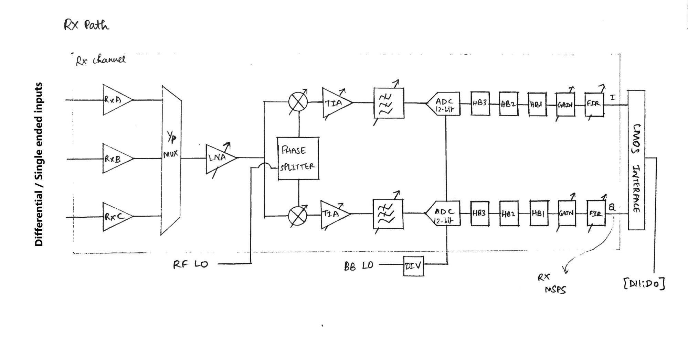
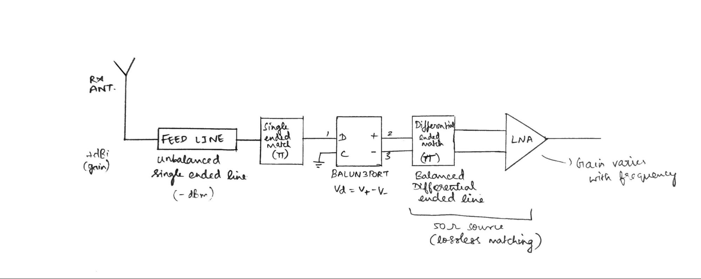
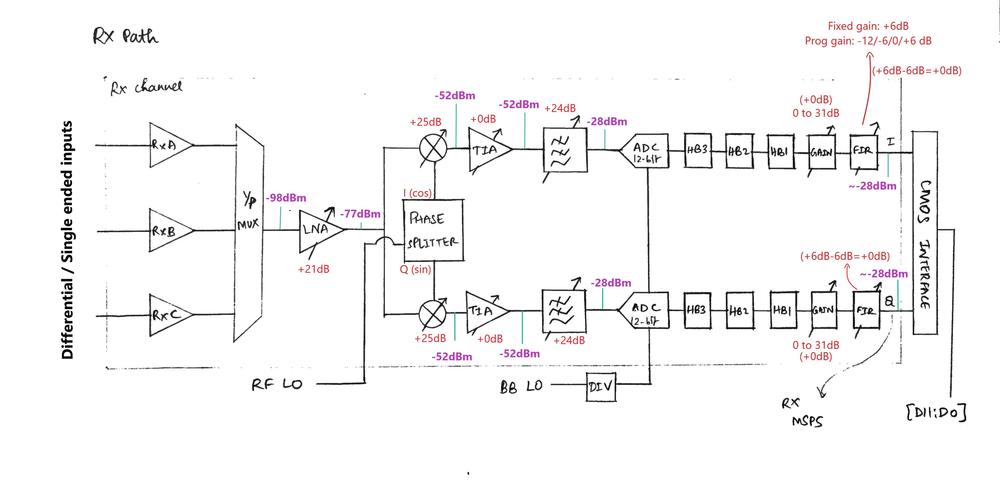
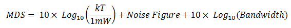

# Direct conversion wideband RF transceiver

Direct conversion wideband RF transceiver is a system which does transmission and reception of a wide range of RF signals from/to baseband signals using single frequency conversion(no IF involved).

Since the direct conversion system has few disadvantages like DC offset, second order distortion and IQ channel mismatch, we need to have self calibration mechanisms in the transceiver to suppress the effects of these disadvantages. Despite these disadvantages the reason we go for the direct conversion system is because it has a simpler design. 

This transceiver can have multiple channels for RX and TX which can operate simultaneously in TDD or FDD modes. 

## LO generation

We also need to have independent local oscillators for RX and TX to operate them simultaneously. The local oscillator generation is done using a fractional N synthesizer to generate the necessary sampling rates with low phase noise for the RF path and Baseband path in RX and TX channels. The channels in RX and TX can share the same frequency synthesizer. 

## Digital Interface

To communicate between the RF transceiver and the baseband processor we use a CMOS/LVDS digital interface. If the drive strength at data converter output is high enough you can use CMOS mode(12-bit single ended parallel output) else you can use LVDS(low voltage differential signalling - 6-bit differential ended parallel output) mode. 

## AGC

Each block’s gain in the RX and TX path like LNA, Mixer, TIA, LPF, GAIN and FIR is controlled by the AGC(Automatic Gain Control). It is used to maintain a constant amplified output signal despite variations in the input signal. 

# Direct conversion RF transmitter

The main characteristics of RF transmitters is to have high transmit EVM(Error vector magnitude - modulation accuracy) and low noise. 

_BB Transmitter section (I/P is 12 bit digital data from BBP in I-Q format)_

*   Programmable 128 tap FIR filter with interpolation options (interpolation factor - 1/2/4)
*   3 Half band digital interpolation filters - provides additional filtering & data rate interpolation
*   12-bit DAC with adjustable sample rates - O/P is I and Q channels

_RF Transmitter section (Upconversion)_

*   2 programmable analog LPFs - to remove sampling noise (has programmable fc)
*   RF mixer - combine I and Q signals and modulate them on carrier frequency
*   Attenuator - to optimize SNR of signal and to improve impedance match at TX
*   Power amplifier - converts a low-power RF signal into a higher power signal before transmission.

# Direct conversion RF receiver

_RF Receiver section (I/P is RF analog signal)_

*   RxA, RxB, RxC differential amplifiers - converts differential signals to single ended output signal for further processing.
*   I/P MUX - used in a diversity system.
*   LNA - Used to amplify a very low-power signal without significantly degrading its SNR  for further processing | Important characteristics are low NF and high gain
*   Phase splitter - to produce in-phase and quadrature signals of the RF LO frequency. 
*   RF Mixer - downconversion mixer - performs frequency translation by mixing LO frequency and RF signal frequency without modifying the phase and amplitude of the signals.
*   TIA - (Single pole LPF) - Sometimes we can have a high frequency blocker signal in the neighbouring band along with the desired band of frequencies. These signals would be amplified in the LNA stage. This can cause distortion and produce different IIP3 values. So to reduce the blocker signals and maintain linearity, these large signal levels are reduced using TIA. 

_BB Receiver section_

*   Programmable 3rd order butterworth analog LPF - Anti-aliasing filters + passes only downconverted LF signals + reduces adjacent channel interference - helps in RF interferer signal reduction
*   12 bit 3rd order continuous sigma-delta high resolution ADC - has adjustable sample rates 
*   3 Half band filters - digital decimation filters - reduces the maximum bandwidth of sampled data by a factor of 2 - can be bypassed - can vary decimation factor to generate correct data rate
*   Variable Gain amplifier - boosts signal level using AGC
*   Programmable 128-tap FIR filter - used for filtering, equalization, and optional additional decimation - can be bypassed | has LPF - removes quantization noise generated by ADC
*   Outputs sampling rate desired by the BBP

# Receiver Characterization

In our receiver, we would use a single ended to differential ended balun because the feed line from the antenna might be an unbalanced line like a coax cable. 

The balun used should match with the differential input impedance of the receiver. So use a matched network to achieve maximum power transfer. The differential input impedance of the receiver varies with frequency so make sure that the balun used operates in the desired frequency range(narrow band). 

If you want your receiver to operate in a wide range of frequencies, you can configure frequency range for different inputs and use the specific baluns for them. 

**Calculation of Minimum detectable signal(MDS) at RX input:**

T = Temperature in Kelvin

k = Boltzmann's constant (−228 dBW/(K·Hz))

If the system temperature is 290 K, then the effective noise power is 10*Log10(kT/1mW) = -174 dBm.

Input RF signal = LTE 20 MHz 2.4 GHz

Bandwidth = 20 MHz

Noise Figure of RF receiver = 3 dB

So MDS (dB) = -174 dBm + 3 dB + 10 log (20 x 10^6) = -98 dBm (Approx)

I have configured the RF blocks to have maximum gain from AGC:

1. Analog Gain
    1. LNA = 21 dB (Programmable gain values = 3/14/17/21)
    2. Mixer = 25 dB (Programmable gain values = 0,3,9,14,15...25)
    3. TIA = 0 dB (Programmable gain values = -6/0)
    4. LPF = 24 dB (Programmable gain values = 0,1,2,...24)
2. Digital Gain
    1. Gain = 0 dB (Programmable gain values = 0,1,2,...31)
    2. FIR = -6 dB (Programmable gain values = -12/-6/0/6 | Fixed gain value = 6dB | Total gain = +6dB + (-6dB) = +0dB)

The final input power to CMOS digital interface is approximately -28 dBm.

The digital gain does not increase SNR. Sacrificing analog gain will decrease performance of the system. But also note that the signal power received by BBP should be a nominal value.

# Future work

Characterization of other blocks in the receiver. 

# Acknowledgments

*   [Kunal Ghosh](mailto:kunalghosh@gmail.com), Co-founder, VSD Corp. Pvt. Ltd.
